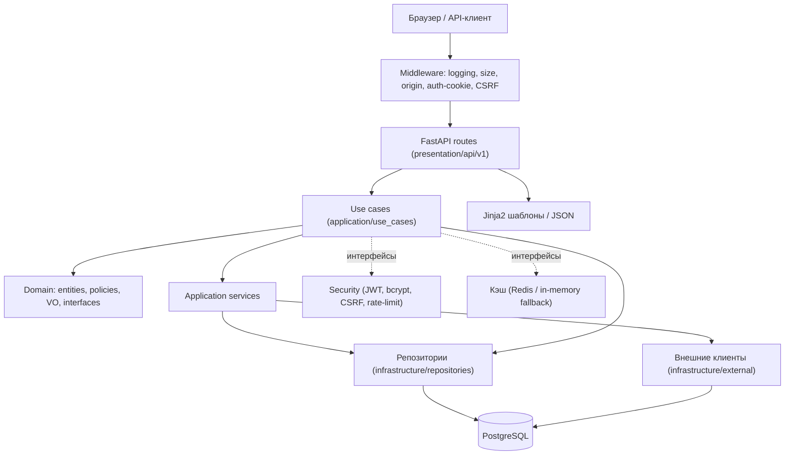
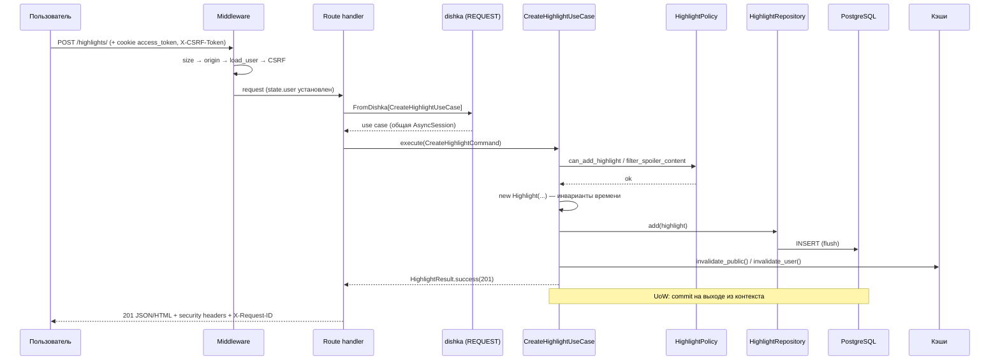

# Обзор архитектуры

## Описание

Документ описывает архитектуру **Anime Epic Moments**: слои backend, полный путь HTTP-запроса,
граф зависимостей (dishka), правила импортов между слоями и известные ограничения дизайна.

**Для кого:** разработчики и ревьюеры. Читать после [onboarding.md](../onboarding.md); при code review
использовать как справочник по границам.

**Когда читать:** перед первым изменением кода backend; при сомнениях «куда положить новый класс».

Смежные документы: требования к коду — [contribution-guide.md](../contribution-guide.md),
доменная модель подробно — [domain/core.md](../domain/core.md).

## Как это работает

### Слои и их ответственность

| Слой            | Каталог                          | Отвечает за                                                                                     | Не делает                                  |
|-----------------|----------------------------------|--------------------------------------------------------------------------------------------------|--------------------------------------------|
| presentation    | `src/backend/presentation`       | HTTP: роутеры зон, мапперы запрос→command, сборка ответа (JSON/HTML), auth-зависимости           | бизнес-правила, SQL                        |
| application     | `src/backend/application`        | use cases (`execute(Command) -> Result`), application-сервисы оркестрации, command/query DTO     | детали транспорта, детали хранения         |
| domain          | `src/backend/domain`             | сущности, value objects, политики, **интерфейсы** репозиториев и внешних сервисов, доменные ошибки | любые импорты из других слоёв              |
| infrastructure  | `src/backend/infrastructure`     | реализации интерфейсов: БД (SQLAlchemy async), Redis, внешние API, кэш, security, DI-провайдеры   | знание о presentation                      |
| config          | `src/backend/config`             | чтение окружения секциями (`sections/*.py`) → класс `Settings`                                   | логика                                     |
| events          | `src/backend/events/lifecycle.py` | lifespan: старт/остановка, инициализация или верификация схемы БД                               | —                                          |
| frontend        | `src/frontend`                   | Jinja2-шаблоны, статика (CSS/JS/изображения). Серверный рендеринг + JSON для AJAX                | —                                          |

Направление зависимостей закреплено контрактом import-linter «Layer Boundaries»:

```
presentation → infrastructure → application → domain
```

(верхний слой может импортировать нижележащие; полная матрица разрешений и запретов —
[contribution-guide.md, п. 1.1](../contribution-guide.md)).



### Полный поток HTTP-запроса

На примере `POST /highlights/` (создание хайлайта):

1. **uvicorn/gunicorn** принимает соединение, отдаёт его в ASGI-приложение `backend.main:app`.
2. **`request_logging_middleware`** (`app_factory.py`): берёт/генерирует `X-Request-ID`, кладёт в
   contextvar `request_id_var`, логирует старт; после ответа — статус и `duration_ms`.
3. **`app_context_middleware`**:
   - проверяет `Content-Length` против `Settings.max_request_bytes` → иначе `413`;
   - блокирует cross-origin write-запросы (Origin/Referer не из `APP_ALLOWED_ORIGINS`) → `403 forbidden_origin`;
   - инициализирует `request.state` (`user=None`, `db_session=None`, ...);
   - если путь не в scope-free списке — **загружает пользователя**: cookie `access_token` →
     `TokenBlocklist.is_revoked()` → `JWTService.decode_token()` → `UserRepository.get_by_id()`
     → `request.state.user`; просроченный/отозванный токен помечает cookie на очистку;
   - выдаёт CSRF-токен; для POST/PUT/PATCH/DELETE валидирует CSRF → иначе `403 csrf_failed`.
4. **Route handler** (`highlight_items_route.py`): Pydantic/Form-модель разбирает вход,
   через `FromDishka[CreateHighlightUseCase]` получает use case; проверяет `request.state.user`
   (аноним → `401`).
5. **dishka REQUEST-scope**: собирает use case со всеми зависимостями (репозиторий, UoW, кэши,
   recommendation service) — все на одной `AsyncSession` этого запроса.
6. **Use case** (`create_highlight.py`): `async with self.unit_of_work:` → проверка
   `HighlightPolicy.can_add_highlight` (лимит гостя) и `filter_spoiler_content` → создание сущности
   `Highlight` (инвариант времени в конструкторе) → `repo.add(highlight)` → инвалидация кэшей
   (рекомендации, дашборд, профиль) → возврат `HighlightResult.success(..., status_code=201)`.
7. **UoW `__aexit__`**: коммит при успехе, rollback при исключении.
8. **Response**: хендлер превращает Result в JSON (или HTML-фрагмент для AJAX);
   middleware добавляет security-заголовки (`apply_security_headers`) и `X-Request-ID`.



### Граф зависимостей (dishka)

Контейнер собирается один раз в `build_dishka_container()` и подключается к приложению через
`setup_dishka(...)` (`app_factory.py`). Провайдеры разбиты по зонам:

| Провайдер                  | Scope   | Что даёт                                                                                             |
|----------------------------|---------|------------------------------------------------------------------------------------------------------|
| `AppProvider`              | APP     | синглтоны: `KeyValueStore` (Redis c in-memory fallback), external-клиенты (Kodik, AniLibria, YouTube, JustWatch, SameBand, AniBoom), `MediaProxyClient`, `FailoverLLMClient` (Gemini primary → HuggingFace fallback), кэши (recommendation, dashboard, profile overview), security (`PasswordService` bcrypt, `JWTService`, `TokenBlocklist`, `CSRFService`, `AccountLockService`, `RateLimiter`), mailers/notifiers |
| `RequestProvider`          | REQUEST | `AsyncSession` (одна на запрос), `SqlAlchemyUnitOfWork`, 8 репозиториев, `RecommendationService`, `WatchSourceSyncService` |
| `<Зона>UseCaseProvider` ×11 | REQUEST | use cases зон: auth, anime, collection, favorite, highlight, moment, reaction, recommendation, support, user, watch |

Правила графа:

- Всё, что держит соединение/состояние между запросами (клиенты, кэши, сторы) — `Scope.APP`;
  у таких провайдеров есть yield-очистка (`await client.aclose()`).
- Всё, что привязано к транзакции (сессия, UoW, репозитории, use cases) — `Scope.REQUEST`.
- Use case никогда не строит зависимости сам — только получает через конструктор; сборка — в
  `di/providers/<зона>.py`.
- Репозитории внутри одного запроса разделяют одну сессию → одна транзакция на запрос.

### Транзакции: Unit of Work

- Интерфейс — `domain/unit_of_work.py` (`UnitOfWorkInterface`: `commit`, `rollback`,
  async-контекст с commit-on-success / rollback-on-failure).
- Реализация — `infrastructure/unit_of_work.py::SqlAlchemyUnitOfWork` поверх общей сессии запроса.
- Use case оборачивает **одну бизнес-операцию**: `async with self.unit_of_work: return await self._execute(cmd)`.
- Репозитории только flush-ат данные в текущую транзакцию и не вызывают `commit` сами.

### Ответы: HTML или JSON

Приложение одновременно SSR-каталог (Jinja2-шаблоны `src/frontend/templates`) и JSON-API для
динамики. Выбор ветки — по `wants_json(request)` (Accept/Content-Type содержат
`application/json`). Ошибки следуют тому же правилу: 404/500 отдают HTML-страницу
(`templates/errors/...`) браузеру и JSON API-клиенту.

### Типичные нарушения границ (антипримеры)

```python
# 1. SQL в use case (должно быть в репозитории)
result = await session.execute(select(HighlightModel).where(...))

# 2. FastAPI-типы в application
def __init__(self, ..., request: Request): ...

# 3. SQLAlchemy-модель возвращается наружу infrastructure (нужен домен/DTO)
return await session.scalar(select(UserModel))

# 4. Домен зависит от инфраструктуры
from backend.infrastructure.security.jwt_service import JWTService  # в domain/

# 5. Роут собирает зависимости руками вместо dishka
use_case = CreateHighlightUseCase(HighlightRepository(get_session()), ...)
```

Все пять вариантов ловятся review; часть (3–4) — автоматически `lint-imports`.

## Почему это сделано так

- **Тонкие routes**: HTTP-детали не смешиваются с поведением; поведение можно тестировать без
  транспорта (unit-тесты use case мокают только интерфейсы).
- **Use case как единица входа**: у каждого пользовательского действия одна явная точка входа —
  легко найти код фичи, оценить её зависимости, покрыть тестом.
- **Domain без фреймворков**: продуктовые правила (инварианты хайлайта, лимиты гостя, статусы
  просмотра) живут в чистом Python и переживают смену FastAPI/SQLAlchemy.
- **Infrastructure отдельно**: проект завязан на ~10 внешних сервисов (LLM, видео-каталоги, SMTP,
  Telegram) — их замена/отключение не должна трогать бизнес-логику; failover (Gemini→HF,
  Redis→memory) инкапсулирован в одном месте.
- **dishka вместо ручной сборки**: граф виден декларативно, scope'ы гарантируют время жизни
  (APP-синглтоны не утекут в другой запрос), тесты подменяют контейнер целиком.
- **Одна сессия на запрос + UoW в application**: транзакционные границы принадлежат сценарию, а не
  репозиторию — составные операции атомарны без вложенных коммитов.
- **Redis как технический слой**: кэш, rate-limit, blocklist — не предметная область, поэтому
  интерфейсы живут в domain/services, но реализация и fallback — в infrastructure.

### Известные ограничения и долг

- Часть use cases возвращает Result с встроенным `status_code` (HTTP-утечка в application) —
  см. [contribution-guide.md, п. 1.4](../contribution-guide.md); новые use cases так не пишут.
- `presentation/dependencies/auth_dependencies.py::auth_required` — легаси-хелпер с
  `Authorization`-заголовком; актуальный механизм — cookie через middleware. Не использовать в новом коде.
- `tests/conftest.py` несёт большой compat-слой эпохи Flask→FastAPI (proxy-обёртки) — мешает
  читаемости тестовой инфраструктуры, выносится в issue, не чинится «попутно».
- Маркер `e2e` объявлен, но каталога `tests/e2e` нет — полные HTTP-сценарии пока не автоматизированы.
- `datetime.utcnow()` (deprecated в 3.12) встречается в моделях/сущностях; в новом коде — `datetime.now(UTC)`.

## Где в коде

| Путь | Роль |
|------|------|
| `src/backend/main.py` | точка входа: `app = create_app()`, uvicorn-раннер |
| `src/backend/presentation/app_factory.py` | фабрика приложения: middleware, роутеры, exception handlers, `setup_dishka` |
| `src/backend/presentation/security_helpers.py` | request-scoped безопасность: load_user, CSRF, origin, размер тела |
| `src/backend/presentation/api/v1/` | 12+ роутеров зон (auth, anime, watch, highlights, ...) |
| `src/backend/application/use_cases/<зона>/` | ~60 use cases; `dto/` — команды и query-объекты |
| `src/backend/domain/` | сущности, политики, VO, `repositories/`, `services/`, `unit_of_work.py` |
| `src/backend/infrastructure/di/providers/` | dishka-провайдеры (app, request, 11 зон use cases) |
| `src/backend/infrastructure/repositories/` | SQLAlchemy-реализации репозиториев |
| `src/backend/infrastructure/external/` | клиенты внешних API и LLM-failover |
| `src/backend/infrastructure/security/` | JWT, bcrypt, CSRF, rate-limit, blocklist, account lock |
| `src/backend/infrastructure/files/database.py` | engine/session factory, `init_db`, `verify_schema` |
| `src/backend/config/settings.py` | агрегация настроек из `config/sections/` |
| `src/backend/utils/logging.py` | setup логирования, contextvars request/user id |

## Связанные документы

- [Contribution Guide](../contribution-guide.md) — матрица импортов, правила кода
- [Конвенции](../conventions.md)
- [Доменная модель](../domain/core.md)
- [API и маршруты](../api/endpoints.md)
- [Схема БД](../database/schema.md)
- [Безопасность](../security/security.md)
- [Хаб документации](../README.md)
