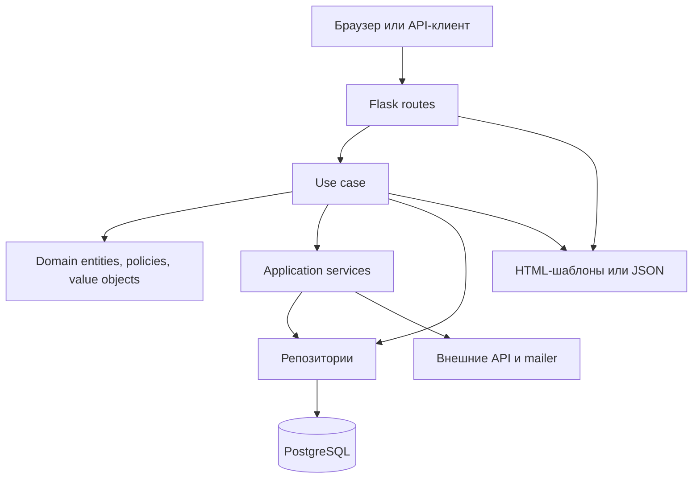
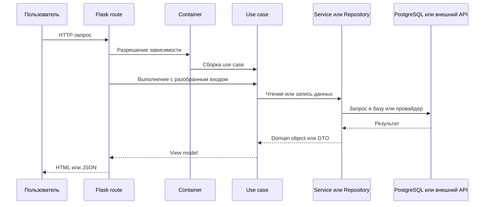

# Обзор архитектуры

## Описание

Система организована как многослойное Flask-приложение с DDD-подобными границами. Delivery-слой принимает HTTP-запросы, use case оркестрируют действия, domain-объекты описывают язык продукта, а infrastructure-слой владеет побочными эффектами: PostgreSQL, внешними провайдерами аниме, кэшированием, JWT и хешированием паролей.

Цель дизайна — не академическая чистота, а прагматичное разделение. Код должен быть легко прослеживаем от маршрута до use case и репозитория и при этом оставаться тестопригодным по слоям.

## Как это работает

Высокоуровневая схема слоев:

Типичный путь пользовательского действия выглядит так:

Конкретные backend-слои:

- Delivery: Flask blueprints в `src/backend/delivery/api/v1`
- Application orchestration: `src/backend/use_case`
- Domain-язык: `src/backend/domain`
- Побочные эффекты: `src/backend/infrastructure`
- Runtime-композиция: `src/backend/dependencies`
- Frontend-шаблоны и статика: `src/frontend`
- Окружение и упаковка: `build`

## Почему это сделано так

- Тонкие routes не смешивают HTTP-детали с бизнес-поведением.
- Use case дают явную точку входа для каждого пользовательского действия.
- Domain-типы не дают продуктовой логике расползтись по неструктурированным словарям.
- Infrastructure можно менять отдельно, что особенно важно при большом количестве внешних интеграций.
- `build/` отделяет deployment- и migration-логику от кода приложения и уменьшает случайную связность.

## Где в коде

- `src/main.py`
- `src/backend/create_app.py`
- `src/backend/dependencies/container.py`
- `src/backend/dependencies/settings.py`
- `src/backend/delivery/api/v1`
- `src/backend/use_case`
- `src/backend/domain`
- `src/backend/infrastructure`
- `src/frontend`
- `build`

## Связанные документы

- [Хаб документации](../README.md)
- [Доменная модель](../domain/core.md)
- [API и маршруты](../api/endpoints.md)
- [Схема базы данных](../database/schema.md)
- [Деплой](../deployment/overview.md)
