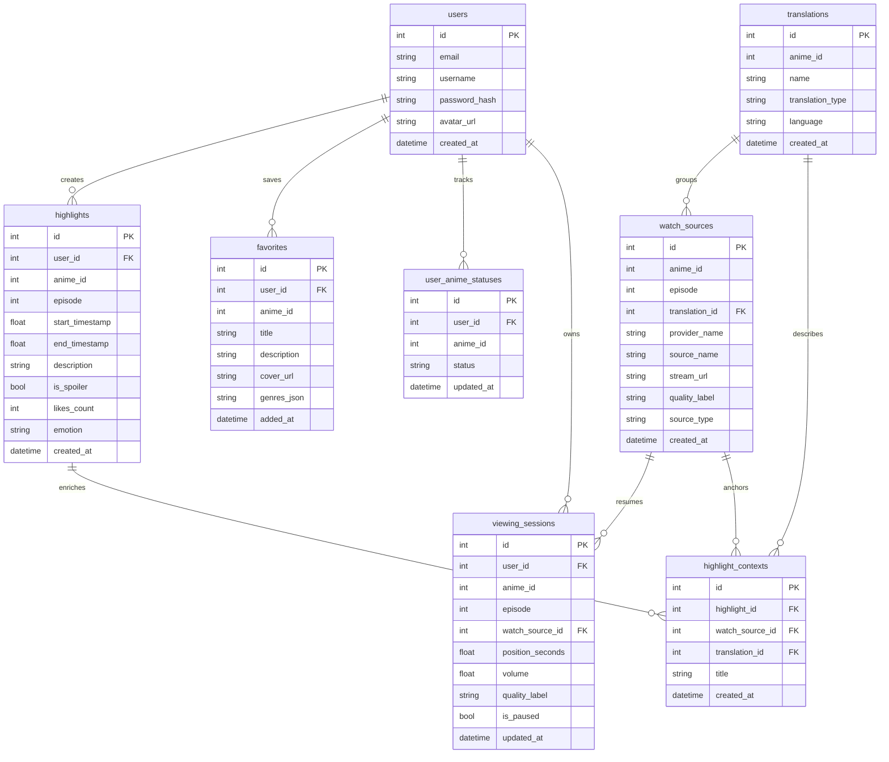

# Схема базы данных

## Описание

Приложение использует PostgreSQL как основное хранилище. В базе сохраняются пользователи и все продуктовые данные, которыми владеет сама система, а каталог аниме в основном остается внешним и подтягивается из Jikan, AniList и других провайдеров.

За миграции отвечает Alembic, активная конфигурация находится в `build/alembic/alembic.ini`.

## Как это работает

Основная схема данных:



Ответственность таблиц:

- `users`: идентичность и профиль
- `favorites`: пользовательские закладки аниме с локальным snapshot-описанием карточки
- `highlights`: моменты из эпизодов, сохраненные пользователем
- `user_anime_statuses`: прогресс пользователя по тайтлам
- `translations`: логические варианты перевода или озвучки
- `watch_sources`: конкретные playable-источники от провайдеров
- `viewing_sessions`: состояние плеера для resume
- `highlight_contexts`: watch-контекст, привязанный к хайлайтам

Процесс миграций:

```powershell
alembic -c build/alembic/alembic.ini revision --autogenerate -m "описание изменения"
alembic -c build/alembic/alembic.ini upgrade head
```

## Почему это сделано так

- Схема хранит продуктовые данные, которые нельзя надежно держать только во внешних API.
- Избранное хранит локальный snapshot, потому что внешние идентификаторы и метаданные у разных провайдеров могут расходиться.
- Слой просмотра разложен на переводы, источники и сессии, чтобы плеер мог восстанавливать реальный контекст просмотра.
- Alembic делает эволюцию схемы явной и воспроизводимой в локальном запуске и в контейнерах.

## Где в коде

- `src/backend/infrastructure/models/sqlalchemy_models.py`
- `src/backend/infrastructure/files/database.py`
- `build/alembic/alembic.ini`
- `build/alembic/env.py`
- `build/alembic/versions`

## Связанные документы

- [Обзор архитектуры](../architecture/overview.md)
- [Деплой](../deployment/overview.md)
- [API и маршруты](../api/endpoints.md)
