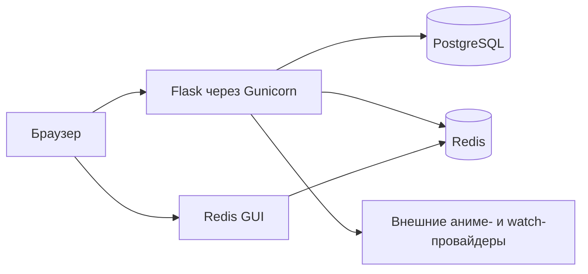
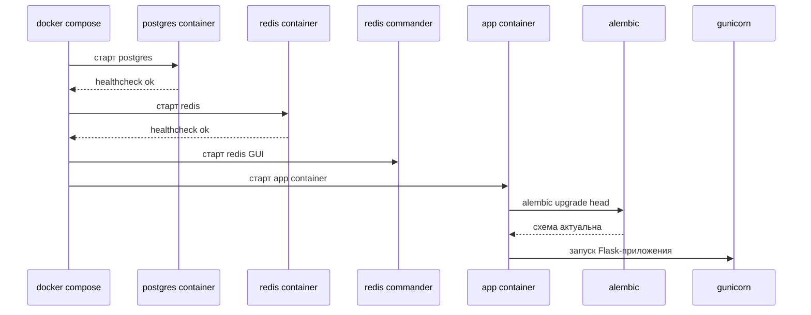

# Деплой

## Описание

Deployment-артефакты живут в `build/`. В этой директории находятся контейнеризация, compose-оркестрация, Alembic runtime и entrypoint, который используется контейнером приложения.

Система может запускаться локально через Python-интерпретатор или в Docker вместе с контейнерами PostgreSQL, Redis и Redis GUI.

## Как это работает

Топология контейнерного запуска:



Последовательность старта в Docker:



Ключевые build-файлы:

- `build/docker-compose.yml`: локальная оркестрация PostgreSQL, Redis, Redis GUI и app-контейнера
- `build/Dockerfile`: Python-образ, установка зависимостей, копирование исходников и регистрация entrypoint
- `build/scripts/entrypoint.sh`: bootstrap со стартом миграций перед web-процессом
- `build/alembic/alembic.ini`: активная конфигурация Alembic
- `build/alembic/env.py`: загрузка metadata и wiring database URL

Локальный путь запуска:

```powershell
alembic -c build/alembic/alembic.ini upgrade head
python -m src.main
```

Запуск в Docker:

```powershell
docker compose -f build/docker-compose.yml up --build
```

Redis GUI в браузере:

```text
http://localhost:8081
```

Ключевые переменные окружения:

- `DATABASE_URL`
- `REDIS_ENABLED`
- `REDIS_REQUIRED`
- `REDIS_URL`
- `REDIS_COMMANDER_PORT`
- `POSTGRES_DB`
- `POSTGRES_USER`
- `POSTGRES_PASSWORD`
- `POSTGRES_HOST`
- `POSTGRES_PORT`
- `DATABASE_AUTO_INIT`
- `RUN_DB_MIGRATIONS`
- `FLASK_HOST`
- `FLASK_PORT`
- `HF_TOKEN`
- API-ключи провайдеров и SMTP-параметры

## Почему это сделано так

- `build/` удерживает deployment-логику отдельно от кода приложения.
- В контейнерах используется Gunicorn, а не debug-сервер Flask.
- Миграции выполняются до старта web-процесса, чтобы не жить с schema drift.
- PostgreSQL используется как единственная runtime-база, что убирает класс проблем, связанных с SQLite-only поведением.
- Redis берет на себя кэши, rate limiting и JWT blocklist, а при локальной деградации код умеет откатываться на in-memory fallback.

## Где в коде

- `build/docker-compose.yml`
- `build/Dockerfile`
- `build/scripts/entrypoint.sh`
- `build/alembic/alembic.ini`
- `build/alembic/env.py`
- `src/main.py`
- `src/backend/dependencies/settings.py`

## Связанные документы

- [Схема базы данных](../database/schema.md)
- [Безопасность](../security/security.md)
- [Онбординг](../onboarding.md)
