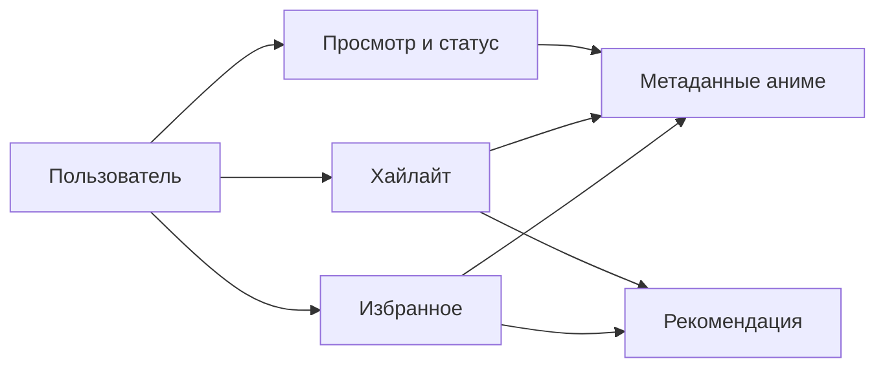

# Доменное ядро

## Описание

Домен проекта строится вокруг действий пользователя при поиске, просмотре и сохранении аниме. Приложение не хранит полный каталог аниме локально: оно хранит пользовательские данные и при необходимости обогащает их внешними метаданными.

Ключевые продуктовые сущности — избранное, хайлайты, состояние просмотра, входные данные для рекомендаций и пользовательская идентичность.

## Как это работает

Основные доменные зоны:

- User: регистрация, аутентификация, профиль, сброс пароля
- Anime: метаданные аниме, используемые в поиске, избранном, просмотре и рекомендациях
- Favorite: связь пользователя с аниме плюс локальный snapshot названия, описания, обложки и жанров
- Highlight: временной диапазон внутри серии, опционально со спойлером и эмоцией
- Watch: переводы, источники просмотра, сессия плеера и статус тайтла у пользователя
- Recommendation: результат рекомендации, полученный из избранного и текстов хайлайтов

Карта домена:

Важные продуктовые правила, уже отраженные в domain или application-логике:

- избранное хранит локальный snapshot метаданных, чтобы страница не зависела от внешнего API при каждом открытии
- синхронизация источников просмотра дедуплицирует провайдеров и варианты переводов
- рекомендации исключают аниме, которые уже есть в избранном или в хайлайтах
- признаки `is_spoiler` и `emotion` являются частью модели хайлайта, а не только frontend-метаданными
- состояние просмотра принадлежит конкретному пользователю, тайтлу и эпизоду

## Почему это сделано так

- Проект зависит от нестабильных внешних провайдеров, поэтому пользовательские данные должны быть устойчивыми даже при деградации API.
- Хайлайты, избранное и watch-state — это продуктовые активы, а не вычисляемый кэш.
- Логика рекомендаций строится на сохраненном поведении пользователя, а не только на глобальной популярности.
- Domain-объекты делают тесты содержательнее, потому что тестируется язык продукта, а не случайные структуры данных.

## Где в коде

- `src/backend/domain/user/entity.py`
- `src/backend/domain/user/exceptions.py`
- `src/backend/domain/anime/entity.py`
- `src/backend/domain/anime/policy.py`
- `src/backend/domain/anime/value_object.py`
- `src/backend/domain/favorite/entity.py`
- `src/backend/domain/favorite/value_object.py`
- `src/backend/domain/highlight/entity.py`
- `src/backend/domain/highlight/policy.py`
- `src/backend/domain/highlight/value_object.py`
- `src/backend/domain/watch/entity.py`
- `src/backend/domain/watch/policy.py`
- `src/backend/domain/watch/value_object.py`
- `src/backend/domain/recommendation/value_object.py`
- `src/backend/use_case`

## Связанные документы

- [Обзор архитектуры](../architecture/overview.md)
- [API и маршруты](../api/endpoints.md)
- [Пользовательские сценарии](../use-cases.md)
- [Глоссарий](../glossary.md)
