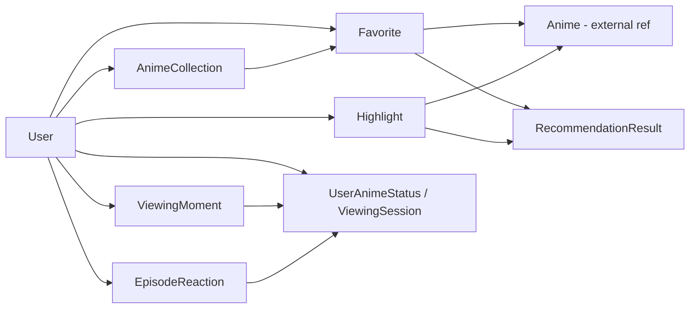

# Доменное ядро

## Описание

Полное описание доменного слоя **Anime Epic Moments**: каждая сущность, value object, политика,
интерфейс репозитория и внешнего сервиса — с полями, инвариантами и примерами использования.

**Для кого:** разработчики. Читать при работе с бизнес-логикой; при ревью — как справочник
«какие правила где живут».

Ключевой принцип: приложение **не хранит каталог аниме** локально — только пользовательские данные.
Метаданные тайтлов приходят из внешних API (Jikan/AniList и видео-провайдеры) и сохраняются в виде
snapshot'ов там, где страница не должна ломаться от недоступности API.

## Как это работает

### Карта домена



Доменные зоны: `user`, `anime`, `favorite`, `collection`, `highlight`, `moment`, `reaction`,
`recommendation`, `support`, `video_source`, `watch` + корневые `exceptions.py` и `unit_of_work.py`.

### Сущности (entities)

#### User — `domain/user/entity.py`

Агрегат пользователя.

| Поле | Тип | Ограничения |
|------|-----|-------------|
| `id` | `int \| None` | None до сохранения |
| `email` | `str` | regex-валидация в конструкторе |
| `username` | `str` | длина 3–20, проверка в конструкторе |
| `password_hash` | `str` | только хэш (bcrypt), пароль в домен не попадает |
| `avatar_url`, `created_at` | опциональные | |

Методы: `update_avatar(url)`, `change_username(new)` (повторно валидирует).
Проверку пароля домен **не делает**: `check_password` намеренно бросает `NotImplementedError` —
сверка через `PasswordServiceInterface` на уровне application.

```python
user = User(email="ann@example.com", username="anna", password_hash=hashed)
# User(email="bad") -> InvalidEmailError; username="ab" -> InvalidUsernameError
```

#### Anime — `domain/anime/entity.py`

Внешняя ссылка на тайтл (`external_id` из Jikan/AniList). Поля: `title`, `description`,
`genres: list[str]`, `year`, `rating`, `cover_url`, `episode_count`. Методы `add_genre` /
`remove_genre` идемпотентны. Инвариантов нет — это read-mostly проекция внешних данных.

#### Favorite — `domain/favorite/entity.py`

Связь «пользователь ↔ аниме» со snapshot метаданных: `title`, `description`, `cover_url`,
`genres_json`. Snapshot гарантирует, что страница избранного работает даже когда внешний API лежит.

#### AnimeCollection / AnimeCollectionItem — `domain/collection/entity.py`

Коллекция (`title`, `description`, `is_public`) и элемент коллекции, тоже со snapshot-метаданными
тайтла. Уникальность `(collection_id, anime_id)` обеспечивается схемой БД
(`uq_collection_anime`) — см. [database/schema.md](../database/schema.md).

#### Highlight — `domain/highlight/entity.py`

Главная социальная сущность: момент серии.

Поля: `user_id` (None = гость), `anime_id`, `episode`, `start_timestamp`, `end_timestamp`,
`title` (нормализуется `.strip()`), `category`, `description`, `is_spoiler`, `emotion`,
счётчики `likes_count`/`views_count`, `created_at`.

**Инвариант:** `start_timestamp < end_timestamp` — иначе `InvalidHighlightTimeError`
(бросается и в конструкторе, и в `edit()`). Нормализация: пустые `category`/`emotion`
превращаются в `None`.

```python
Highlight(user_id=1, anime_id=101, episode=3, start_timestamp=120.0, end_timestamp=95.0)
# -> InvalidHighlightTimeError
```

#### ViewingMoment — `domain/moment/entity.py`

«Черновик» хайлайта, захваченный во время просмотра: `timestamp`, `caption`, `sticker`,
`screenshot_url`, `watch_source_id`. Жизненный цикл: draft → `publish_viewing_moment` → публичный
хайлайт, либо удаление. Отдельная таблица нужна, чтобы захват момента не создавал мусорных публикаций.

#### EpisodeReaction — `domain/reaction/entity.py`

Реакция пользователя на момент эпизода. Типы — `StrEnum` `EpisodeReactionType`:
`fire, love, laugh, cry, shock, skull, sparkle` (+ карта эмодзи `EPISODE_REACTION_EMOJI`).
Уникальность `(user_id, anime_id, episode)` — одна реакция на эпизод от пользователя
(`uq_episode_reaction`). Агрегированное состояние эпизода — VO `EpisodeReactionSummary`.

#### SupportTicket — `domain/support/entity.py`

Тикет поддержки: `email`, `username`, `subject`, `message`, `channel` (`telegram` | `email`,
константы в `support/channel.py`), `page_url`, `status` (по умолчанию `open`),
`delivery_status`/`delivery_error` — результат доставки уведомления админам.

#### Watch-зона — `domain/watch/entity.py`

Пять сущностей просмотра:

- `UserAnimeStatus` — статус тайтла у пользователя: `status`, `current_episode`, `started_at`,
  `completed_at`, `last_watched_at`, `rating`, `note`;
- `Translation` — озвучка: `name`, `translation_type`, `language`;
- `WatchSource` — конкретный источник серии: `provider_name`, `source_name`, `stream_url`,
  `quality_label`, `source_type`; FK на `translation_id`;
- `ViewingSession` — состояние плеера: `position_seconds`, `volume`, `quality_label`, `is_paused`;
- `HighlightContext` — привязка хайлайта к источнику и переводу (чтобы шареная ссылка открывала
  правильный плеер).

#### VideoSource — `domain/video_source/entity.py`

Нормализованный результат внешнего провайдера: enum `ProviderName`, `VideoSourceMetadata`.
Используется sync-сервисом источников до превращения в `WatchSource`.

### Value objects

Неизменяемые `@dataclass` для чтения/отображения (не имеют identity):

| Группа | Классы | Назначение |
|--------|--------|------------|
| highlight | `HighlightCard`, `HighlightStats`, `HighlightLikeUser`, `HighlightCommentItem`, `HighlightEngagement`, `HighlightProfileSummary`, `HighlightActivityItem`, `HighlightAnimeGroup`, `HighlightFeedPage`, `HighlightDashboard` | карточки, лента, дашборд |
| user | `GenreAffinity`, `ProfileMoodInsight`, `TopAnimeEntry`, `ViewingHeatmapCell`, `AchievementBadge`, `SmartProfile`, `ProfileOverview`, `FollowUserCard`, `PublicProfileOverview`, `PendingEmailVerification` | профиль и «умный» профиль |
| watch | `DiaryEntry`, `DiscoveredWatchSource`, `WatchSourceCard`, `WatchHighlightCard`, `WatchedAnimeStat`, `ViewingHeatmapPoint`, `WatchPageData` | страница просмотра, дневник |
| anime | `SearchAnimeByDescriptionResult`, `AnimeDiscussionComment`, `AnimeDiscussionBoard` | AI-поиск, обсуждения |
| collection | `CollectionCard`, `CollectionItemCard`, `CollectionDetails` | страницы коллекций |
| reaction | `EpisodeReactionCount`, `EpisodeReactionSummary` | агрегаты реакций |
| favorite | `FavoriteAnimeCard` | карточка избранного |
| recommendation | `RecommendationResult` | результат рекомендации |

Правило: use cases возвращают VO/Result-объекты, а не сырые dict — см.
[contribution-guide.md, п. 2.2](../contribution-guide.md).

### Политики

Бизнес-правила, отделённые от сущностей:

- **`HighlightPolicy`** (`highlight/policy.py`): `GUEST_MAX_PER_HOUR = 5` — гость может добавить не
  более 5 хайлайтов в час (`can_add_highlight`); `filter_spoiler_content` — запрещённые слова;
  `should_hide_spoiler` — скрывать ли спойлер в UI. Пример вызова — `create_highlight.py`.
- **`AnimeSafetyPolicy`** (`anime/policy.py`): age-gate поиска — `has_explicit_adult_intent`
  (маркеры 18+ в запросе), `is_probably_nsfw` (фильтр карточек), `suggest_title_hints`
  (извлечение `"..."`/«...» подсказок названий).
- **`domain/user/policy.py`** — функции «умного профиля»: `build_genre_affinities` (топ жанров),
  `detect_profile_mood` (доминирующий вайб по жанрам/эмоциям) и др. Замечание: это модульные
  async-функции без класса `<Сущность>Policy` — историческое исключение из нейминга
  (см. [contribution-guide.md, п. 1.2](../contribution-guide.md)).

### Порты репозиториев (`application/interface/repositories/`)

Восемь контрактов по одному на агрегат: `UserRepository`, `HighlightRepository`,
`FavoriteRepository`, `CollectionRepository`, `WatchRepository`, `MomentRepository`,
`ReactionRepository`, `SupportRepository`. Методы асинхронные и говорят на языке домена
(`add(highlight)`, `get_by_email(...)`, ...), без терминов SQLAlchemy.
Реализации — зеркальные файлы в `infrastructure/repositories/`.

### Порты сервисов (`application/interface/services/`)

Границы всех побочных эффектов объявлены здесь, реализации — в infrastructure:

| Интерфейс | Реализация | Зачем |
|-----------|------------|-------|
| `PasswordServiceInterface` | `security/password_service.py` | bcrypt-хэширование |
| `JWTServiceInterface` | `security/jwt_service.py` | выпуск/проверка токенов |
| `TokenBlocklistInterface` | `security/token_blocklist.py` | отзыв access-токенов |
| `TTLCacheInterface` | `cache/ttl_cache.py` | TTL-кэш |
| `RecommendationCacheInterface`, `HighlightDashboardCacheInterface`, `ProfileOverviewCacheInterface` | `cache/*` | предметные кэши |
| `RecommendationServiceInterface` | application-сервис | генерация рекомендаций |
| `WatchSourceProviderInterface`, `WatchSourceSyncServiceInterface` | `external/*` | источники серий |
| `AnimeApiClientInterface` | `external/anime_api_client.py` | метаданные тайтлов |
| `LLMClientInterface` | `external/failover_llm_client.py` (Gemini → HuggingFace) | AI-функции |
| `EmailVerification*Interface`, `PasswordResetMailerInterface`, `SupportEmailMailerInterface`, `TelegramSupportNotifierInterface` | `external/*` | письма и уведомления |

### Доменные ошибки

```
DomainError (domain/exceptions.py)
├── NotFoundError · ValidationError · AuthenticationError
├── AuthorizationError · DuplicateError · ExternalServiceError
```

Известный долг (не копировать): `InvalidEmailError`/`InvalidUsernameError`
(`user/exceptions.py`) и `InvalidHighlightTimeError` (`highlight/entity.py`) наследуются от голого
`Exception` вне иерархии `DomainError`. Переносить в общую иерархию при касании файлов —
[contribution-guide.md, п. 1.4](../contribution-guide.md).

## Почему это сделано так

- **Snapshot вместо live-данных** (избранное, коллекции, элементы): внешние API нестабильны и
  лимитированы — пользовательские страницы обязаны работать при их деградации.
- **Хайлайты/избранное/watch-state — активы, не кэш**: это то, ради чего пользователь возвращается;
  терять их нельзя, поэтому они первоклассные агрегаты с репозиториями.
- **Политики отдельно от сущностей**: лимиты гостя или age-gate меняются продуктово и часто — их
  правка не должна трогать инварианты сущностей; политики чистые и легко тестируются.
- **Инварианты в конструкторе** (`Highlight._validate_times`): невозможно получить невалидный объект,
  минуя правило — защита на уровне типа, а не дисциплины вызывающего кода.
- **Интерфейсы сервисов в domain**: use cases зависят от контракта «mailer», а не от SMTP — тесты
  мокают контракт, замена провайдера не трогает логику.
- **Рекомендации из своего поведения**: строятся по избранному и текстам хайлайтов пользователя,
  а не по глобальной популярности — продукт персонален даже без ML.

## Где в коде

| Путь | Роль |
|------|------|
| `src/backend/domain/aggregates/<зона>/` | корни агрегатов: `user/` (User), `highlight/` (Highlight), `collection/` (AnimeCollection) |
| `src/backend/domain/entities/<зона>/` | сущности без детей: Anime, Favorite, ViewingMoment, EpisodeReaction, SupportTicket, watch-пятёрка |
| `src/backend/domain/value_objects/<зона>/` | неизменяемые read-модели по зонам |
| `src/backend/domain/policies/` | HighlightPolicy, AnimeSafetyPolicy, профильные и watch-правила |
| `src/backend/application/interface/repositories/` | порты: интерфейсы 8 репозиториев |
| `src/backend/application/interface/services/` + `unit_of_work.py` | порты сервисов, кэшей и транзакционной границы |
| `src/backend/domain/exceptions.py`, `unit_of_work.py` | ошибки и транзакционная граница |
| `tests/unit/domain/<зона>/` | тесты каждой зоны (entity/policy/value_object) |

Правило размещения: агрегат = корень с детьми или инвариантной границей; сущность —
самостоятельный объект без детей; VO — dataclass без identity. Политики вынесены в общий
каталог `policies/`.

## Связанные документы

- [Обзор архитектуры](../architecture/overview.md)
- [Схема БД](../database/schema.md)
- [API и маршруты](../api/endpoints.md)
- [Пользовательские сценарии](../use-cases.md)
- [Contribution Guide](../contribution-guide.md)
- [Глоссарий](../glossary.md)
