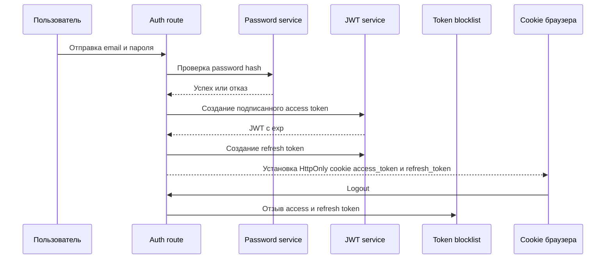

# Безопасность

## Описание

Этот документ фиксирует, что в приложении уже защищено, а что еще нужно усилить, прежде чем считать систему полноценно готовой к внешнему интернет-трафику. Цель документа — точность, а не оптимистичная картинка.

Проект уже получил более устойчивую основу за счет PostgreSQL, Redis и Alembic, но полноценное hardening-покрытие на уровне edge и application еще не завершено.

## Как это работает

### Что уже реализовано

| Зона | Текущее состояние | Реализация |
| --- | --- | --- |
| Хранение паролей | Реализовано | Пароли хешируются через `bcrypt` |
| Целостность токенов | Реализовано | JWT подписываются секретом приложения |
| Срок жизни токенов | Реализовано | Access token и reset token содержат expiration |
| Refresh flow | Реализовано | Выдаются отдельные refresh token с перевыпуском access token |
| Logout blacklist | Реализовано | Logout отзывает access и refresh token через blocklist |
| Защита от SQL injection | Частично реализовано | Репозитории используют SQLAlchemy ORM вместо ручной сборки SQL |
| Разделение секретов | Реализовано | Runtime-секреты приходят из `.env` через `Settings` |
| Утечка внутренних ошибок | Частично реализовано | Для 500 есть контролируемый ответ вместо сырого traceback |
| Контроль debug-режима | Реализовано | Debug выключен по умолчанию и задается окружением |
| Контроль изменений схемы | Реализовано | Изменения схемы проходят через Alembic |
| Rate limiting | Реализовано | Критичные endpoint'ы ограничены по Redis или memory-fallback |
| Security headers | Реализовано | Выставляются CSP, `X-Frame-Options`, `X-Content-Type-Options`, `Referrer-Policy` |
| Ограничение payload size | Реализовано | Через `MAX_CONTENT_LENGTH` и 413 handler |
| Частичная CSRF-защита | Частично реализовано | Cross-origin write-запросы режутся по Origin/Referer check |

### Что еще не реализовано

| Зона | Статус | Чего не хватает |
| --- | --- | --- |
| Полноценный CSRF-token flow | Отсутствует | Нет серверной схемы с токеном на формы и AJAX |
| HSTS | Отсутствует | Нет `Strict-Transport-Security` на уровне приложения или reverse proxy |
| Audit logging | Отсутствует | Нет структурированного логирования security-событий |
| Блокировка по попыткам | Частично | Есть throttling, но нет долгосрочной блокировки аккаунта |
| Централизация валидации | Частично | Валидация разбросана по routes и не единообразна |

Текущий auth-flow:

## Почему это сделано так

- На раннем этапе приоритет был у продуктовых сценариев, корректности БД и тестируемости.
- Хеширование паролей и подписанные токены — минимальный обязательный security-baseline для пользовательской системы.
- ORM снижает риск класса ошибок, связанных с SQL injection, не делая код репозиториев нечитаемым.
- Следующий шаг — не просто писать новые документы, а закрывать оставшиеся пробелы: CSRF-token flow, HSTS, аудит и более жесткую бизнес-защиту.

## Следующая итерация усиления безопасности

1. Добавить полноценные CSRF-токены для form и AJAX mutation endpoint'ов.
2. Включить `COOKIE_SECURE=1` и HSTS в production-окружении.
3. Ввести структурированное audit-логирование auth-событий и повторных отказов.
4. Добавить долгосрочные блокировки и cooldown на бизнес-операции.
5. Вынести метрики и мониторинг в отдельный observability-слой.

## Где в коде

- `src/backend/create_app.py`
- `src/backend/dependencies/settings.py`
- `src/backend/dependencies/auth_dependencies.py`
- `src/backend/infrastructure/cache/key_value_store.py`
- `src/backend/infrastructure/security/jwt_service.py`
- `src/backend/infrastructure/security/password_service.py`
- `src/backend/infrastructure/security/rate_limiter.py`
- `src/backend/infrastructure/security/token_blocklist.py`
- `src/backend/infrastructure/security/flask_protection.py`
- `src/backend/infrastructure/files/database.py`
- `build/docker-compose.yml`
- `build/Dockerfile`

## Связанные документы

- [Обзор архитектуры](../architecture/overview.md)
- [API и маршруты](../api/endpoints.md)
- [Деплой](../deployment/overview.md)
