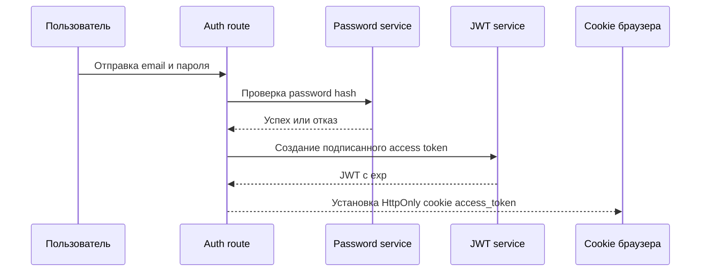

# Безопасность

## Описание

Этот документ фиксирует, что в приложении уже защищено, а что еще нужно усилить, прежде чем считать систему полноценно готовой к внешнему интернет-трафику. Цель документа — точность, а не оптимистичная картинка.

Проект уже получил более устойчивую основу за счет PostgreSQL и Alembic, но полноценное hardening-покрытие на уровне edge и application еще не завершено.

## Как это работает

### Что уже реализовано

| Зона | Текущее состояние | Реализация |
| --- | --- | --- |
| Хранение паролей | Реализовано | Пароли хешируются через `bcrypt` |
| Целостность токенов | Реализовано | JWT подписываются секретом приложения |
| Срок жизни токенов | Реализовано | Access token и reset token содержат expiration |
| Защита от SQL injection | Частично реализовано | Репозитории используют SQLAlchemy ORM вместо ручной сборки SQL |
| Разделение секретов | Реализовано | Runtime-секреты приходят из `.env` через `Settings` |
| Утечка внутренних ошибок | Частично реализовано | Для 500 есть контролируемый ответ вместо сырого traceback |
| Контроль debug-режима | Реализовано | Debug выключен по умолчанию и задается окружением |
| Контроль изменений схемы | Реализовано | Изменения схемы проходят через Alembic |

### Что еще не реализовано

| Зона | Статус | Чего не хватает |
| --- | --- | --- |
| CSRF | Отсутствует | Нет CSRF-защиты для cookie-auth form и mutation маршрутов |
| Флаги cookie | Отсутствует | Не выставляются `Secure`, `SameSite` и policy по окружениям |
| CSP и clickjacking | Отсутствует | Нет `Content-Security-Policy` и `X-Frame-Options` |
| Rate limiting | Отсутствует | Нет защиты от brute-force и abuse на auth и search |
| Security headers | Отсутствует | Нет HSTS, `X-Content-Type-Options` и frame policy middleware |
| Audit logging | Отсутствует | Нет структурированного логирования security-событий |
| Блокировка по попыткам | Отсутствует | Нет throttling по повторным неудачным логинам |
| Централизация валидации | Частично | Валидация разбросана по routes и не единообразна |

Текущий auth-flow:

## Почему это сделано так

- На раннем этапе приоритет был у продуктовых сценариев, корректности БД и тестируемости.
- Хеширование паролей и подписанные токены — минимальный обязательный security-baseline для пользовательской системы.
- ORM снижает риск класса ошибок, связанных с SQL injection, не делая код репозиториев нечитаемым.
- Следующий шаг — не просто писать новые документы, а добавлять явный hardening в delivery- и deployment-слои.

## Следующая итерация усиления безопасности

1. Добавить CSRF-защиту для form и JSON mutation endpoint'ов.
2. Настроить флаги cookie в зависимости от окружения, включая `Secure` и `SameSite`.
3. Добавить middleware с security headers для CSP, frame ancestry и защиты от content sniffing.
4. Добавить rate limiting вокруг login, register, password reset и search.
5. Ввести структурированное audit-логирование auth-событий и повторных отказов.

## Где в коде

- `src/backend/create_app.py`
- `src/backend/dependencies/settings.py`
- `src/backend/dependencies/auth_dependencies.py`
- `src/backend/infrastructure/security/jwt_service.py`
- `src/backend/infrastructure/security/password_service.py`
- `src/backend/infrastructure/files/database.py`
- `build/docker-compose.yml`
- `build/Dockerfile`

## Связанные документы

- [Обзор архитектуры](../architecture/overview.md)
- [API и маршруты](../api/endpoints.md)
- [Деплой](../deployment/overview.md)
